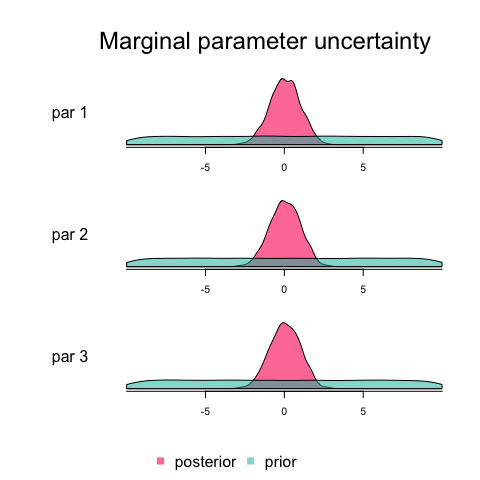

# Speich et al., Sequential Monte-Carlo algorithms for Bayesian model calibration

**Summary:** This folder documents the scripts used to generate the simulations described in the manuscript “Sequential Monte-Carlo algorithms for Bayesian model calibration – a review and method comparison” by M. Speich, C.F. Dormann and F. Hartig, currently in revision.

## How to use the SMC function in your own work

To **use the SMC function in your own work**, install the following development branch, which will soon be merged with the main BT branch and included in CRAN. This branch includes updated documentation and further integration of the SMC function in the BT environment. 


```r
devtools::install_github(repo = "florianhartig/BayesianTools", subdir = "BayesianTools", 
                                 ref = "SMC-Merge", dependencies = T, build_vignettes = F)
```

Here a short example on how to calibrate a model with this function:


```r
library(BayesianTools)
bayesianSetup <- createBayesianSetup(likelihood = generateTestDensityMultiNormal(), 
                                     lower = rep(-10, 3),
                                     upper = rep(10, 3), parallel = "external")

SMCout <- smcSampler(bayesianSetup)
marginalPlot(SMCout, type = "d", singlePanel = T)
```

<!-- -->

In this case, the calibration target was a simple multivariate normal likelihood (created by generateTestDensityMultiNormal), multiplied with wide uniform priors (provided by the lower / upper argument). If calibrating your own model, you would have to switch this to your desired likelihood / prior. 

* To understand how other calibration targets can be specified, see the help of ?createBayesianSetup, as well as the [general tutorial / vignette of the BT package](https://cran.r-project.org/web/packages/BayesianTools/vignettes/BayesianTools.html). For a realistic example (calibration of small ecosystem model), see ?VSEM 
* Note that the online vignette does not yet include the latest changes to the SMC sampler which is described in Speich et al. To get help on those settings, run ?smcSampler (provided that the development version was installed as explained above). 

## How to reproduce the results in the paper

To exactly reproduce the results in the paper, you should install the code branch with the BT version with which results were created, which is 


```r
devtools::install_github(repo = "florianhartig/BayesianTools", subdir = "BayesianTools", 
                                 ref = "SMC", dependencies = T, build_vignettes = F)
```

You should then be able to run the following scripts, which were used to recreate the examples in the paper: 

### 1.	Scripts to generate reference MCMC data

For each dynamical model, a reference sampler was generated by applying the MCMC-DEZS algorithm with a large number of iterations (see Table 1 of the manuscript). This sampler represents the benchmark against which the MCMC and SMC runs were compared, i.e. quality of these samplers was assessed as the distance (see Eq. 5 in the manuscript) to this reference. VSEM a and b refer to the versions with and without strong correlation, respectively. Regarding 3-PGN, as the only difference between 3-PGN and 3-PGNsleep is an artificial increase of runtime, the same reference sampler could be used for these two cases. The output of this script is written to a file, which is loaded by the MCMC and SMC benchmarking scripts.

### 2.	Scripts to benchmark the MCMC algorithm

Depending on the model, it was sometimes faster to use the DEZS algorithm with or without parallelization (see Table 1). The version provided here is the version that was used in the study, i.e. the faster one. These scripts take one argument, to be supplied via command line. This argument is a number, which was used here to differentiate between the five instances of the script that were run. The random seed is also set on this number, to guarantee that the five runs are different from each other, but reproducible.

### 3.	Scripts to benchmark the SMC algorithm

Analogously to the MCMC benchmark scripts, the SMC scripts were executed five times, so that they also take a number as command line argument. For the multivariate normal case, the reference, MCMC and SMC benchmarks are all generated in the same file.

### 4.	Scripts for parallelization benchmark

This folder contains the files used for the benchmark of SMC under different parallelization options. The files for the runs on a single core take only one command-line argument (run number, as above), whereas the files for 2 or more cores also take the number of cores as an additional command-line argument.

### 5.	Launch scripts

This file provides examples of files used to launch our scripts on the NEMO cluster, using the MOAB scheduling system. They cannot be executed on a cluster with a different scheduler, but provide some guidance on how to specify the command-line arguments.
